# VéloQuest — Donne une destination à chaque coup de pédale.

**Ton vélo. Ton rythme. Une aventure qui donne envie de revenir.**

Ce soir, tu peux longer la Méditerranée, retrouver les villages du vignoble alsacien, avancer sur la Route Napoléon ou simplement prendre quinze minutes pour toi. Demain, tu pourras reprendre ton voyage, travailler ta régularité ou tenter un nouveau record. Avec **VéloQuest**, le vélo d’appartement devient un rendez-vous personnel : une séance qui a du sens, une destination qui t’attire et des progrès que tu peux retrouver.

Entraînement guidé, exploration, défis, programme personnel, récompenses et suivi se retrouvent dans une seule application. Tu choisis ce qui te motive ; VéloQuest t’aide à lui faire une place dans ton quotidien.

**[Ouvrir VéloQuest →](https://programme-velo.vercel.app/)** · [Retour au README](../README.md) · [Catalogue complet](CATALOGUE.md)

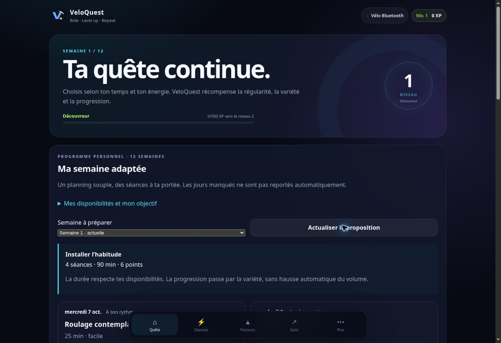

| Une application à explorer | De quoi renouveler tes séances |
| --- | --- |
| **52 séances** | De 3 à 70 minutes, du mouvement doux aux formats sportifs |
| **84 parcours** | Balades, étapes vallonnées, grands cols et formats courts |
| **38 balades à 1/5** | Des destinations accessibles, avec un effort doux conseillé |
| **12 thèmes de découverte** | Littoral, lacs, canaux, patrimoine, vignobles et montagne |
| **12 semaines de programme** | Des objectifs personnalisables et une semaine adaptée |
| **6 programmes découverte** | Six chemins pour reprendre, varier et progresser |
| **22 campagnes et carnets prédéfinis** | Des aventures à construire au fil des sorties |
| **77 badges** | Régularité, découverte, parcours, programmes et objectifs |
| **Des carnets personnels et tes GPX** | Tes propres idées de voyage rejoignent le catalogue |

*Présentation de la version vérifiée le 7 octobre 2026 (`1147628`). Captures authentiques de l’application publiée, sur ordinateur. Les écrans de suivi utilisent le profil « Camille · démo fictive » : ses séances et mesures sont des exemples, pas des résultats utilisateurs ni une promesse de résultat.*

## Choisis ce qui te donne envie

- [Commencer simplement](#commencer)
- [Construire ta semaine et écouter le coach](#programme)
- [Trouver ta séance](#seances)
- [Voyager parmi 84 parcours](#parcours)
- [Avancer en plusieurs séances](#voyage)
- [Collectionner les étapes et créer tes carnets](#carnets)
- [Profiter du lecteur et de ses commandes](#lecteur)
- [Jouer avec la précision et les records](#defis)
- [Gagner des niveaux et des trophées](#recompenses)
- [Voir tes progrès](#suivi)
- [Connecter ton vélo ou rouler en manuel](#connexion)
- [Installer, emporter et sauvegarder VéloQuest](#quotidien)
- [Trouver une première idée pour ce soir](#demarrer)
- [Consulter les questions fréquentes](#questions)

## Quelques minutes pour commencer. Une aventure à construire ensuite.

Pas de compte à créer avant de découvrir l’application. Le guide d’accueil te demande ce qui te motive : installer une habitude, gagner en endurance ou découvrir des paysages. Tu indiques ton point de départ, ton créneau habituel et un cap de régularité. Le prénom est facultatif ; les mesures corporelles aussi.

VéloQuest t’explique les consignes, l’échelle de résistance et le **RPE**, la note qui exprime ton ressenti d’effort. Puis **Premiers tours de roue** te propose quinze minutes faciles, en trois segments. Tu peux regarder la préparation avant de démarrer, remettre la séance à plus tard ou explorer librement.

La Quête accompagnée se dévoile progressivement : découvrir les consignes, trouver ton rythme, choisir ton chemin. Les suggestions prennent ensuite en compte le temps et l’énergie du jour. Tu n’as pas besoin de maîtriser toutes les fonctions pour profiter de ta première sortie.

Le guide retrouve son étape après une interruption. Tu peux aussi le revoir depuis **Plus**, sans effacer ton historique. Et si tu arrives avec une sauvegarde, sa restauration est accessible dès l’accueil.

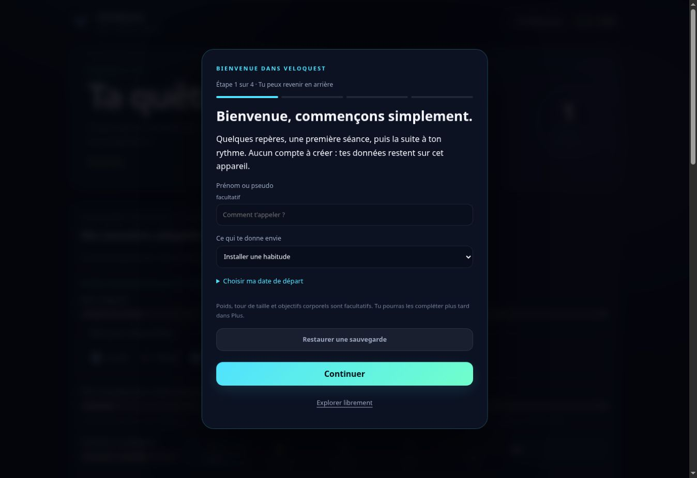

## Un programme qui fait de la place à ta vraie vie

### Ta semaine, selon tes disponibilités

Dans **Quête → Ma semaine adaptée**, tu choisis tes jours disponibles, un créneau maximum de 10 à 60 minutes, ton énergie et ton objectif : installer une routine, être à l’aise plus longtemps ou accompagner une démarche de perte de poids.

VéloQuest propose une semaine lisible, avec les séances, les durées et les points correspondants. **Tu confirmes la proposition avant qu’elle devienne ton planning.** Un imprévu ? Tu peux déplacer, raccourcir ou remplacer une séance par les propositions disponibles. Les jours manqués ne créent pas une dette d’entraînement à rattraper.

Le cycle dure douze semaines. Les deux premières installent des bases faciles ; les semaines 4, 8 et 12 sont allégées. Une interruption prolongée ou des ressentis trop élevés peuvent également conduire à une proposition plus douce. La progression privilégie la variété et une pratique tenable, sans augmentation automatique du volume.

### Un coach pour choisir aujourd’hui

Tu préfères décider au dernier moment ? Le **Coach Express** rapproche ton temps disponible, ton énergie, tes séances récentes et leur ressenti pour proposer une séance, avec les raisons de ce choix. Il tient compte de la charge et des interruptions. Des points encore manquants ne suffisent pas à pousser sa recommandation vers une séance plus intense.

Le coach fonctionne localement, sans clé d’IA ni abonnement externe. Ses conseils sont des repères d’entraînement issus de règles transparentes ; ton ressenti garde la priorité.

### Des objectifs que tu comprends

Minutes, séances, variété et points donnent plusieurs façons de voir la semaine avancer. Le plafond de séances difficiles fait partie de la réussite : accumuler de l’intensité ne remplace pas une pratique équilibrée. Depuis **Plus**, tu peux également ajuster le nombre de séances et leur durée habituelle.

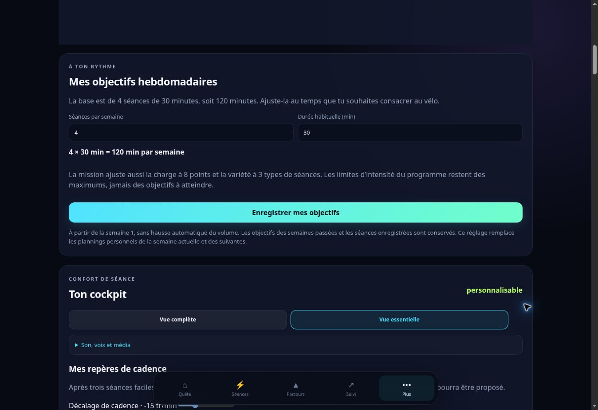

*Pour accompagner un objectif corporel, VéloQuest met l’accent sur la régularité et le suivi. Il ne transforme pas des calories en promesse de kilos perdus.*

## 52 séances pour que chaque journée trouve son rythme

Il y a les soirs où l’on veut se dépenser, ceux où l’on dispose d’une demi-heure et ceux où quelques minutes de mouvement sont déjà une belle décision. Le catalogue couvre ces différentes envies, avec des formats faciles, soutenus ou durs, une préparation et des consignes segment par segment.

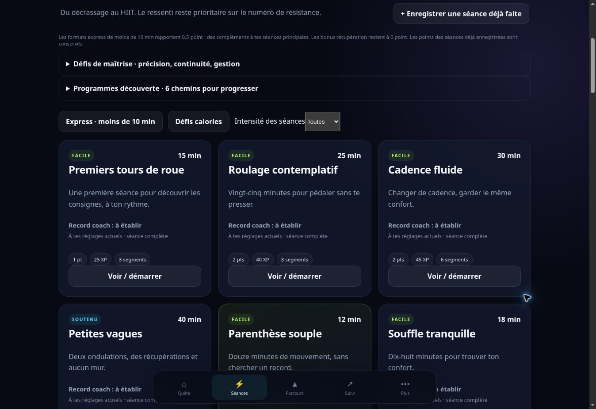

| Ton envie | Quelques séances à découvrir |
| --- | --- |
| Reprendre en douceur | Premiers tours de roue, Reprendre doucement, Retrouver ses repères |
| Pédaler sans te presser | Roulage contemplatif, Souffle tranquille, La ligne tranquille |
| Construire de l’endurance | Endurance, Endurance nomade, Un peu plus longtemps, Grande traversée |
| Varier le relief | Faux-plats en douceur, Deux petites collines, Petites vagues, Cols |
| Travailler ta précision | Cadence douce, Cadence fluide, Le métronome, Six minutes de précision |
| Mieux gérer ton effort | Garder une réserve, Finir avec aisance, Petites bosses, rythme stable |
| Choisir une séance sportive | Ascension, Impact, Forge 4×4, Ligne rouge, Escalier |
| Profiter d’un petit créneau | Pause active · 3 min, Petit tour · 4 min, Vagues express, Tempo minute |
| Ajouter un complément facile | Micro bonus 10/15/20 minutes, Parenthèse souple, Pause active |
| Suivre ta propre inspiration | Séance libre ou enregistrement d’une séance déjà faite |

Chaque fiche annonce sa durée, son intensité, ses segments et sa récompense. Les filtres **Express · moins de 10 min**, **10–20 min**, **Défis calories** et **Intensité** permettent de retrouver rapidement le bon format. Les séances express structurées de moins de dix minutes rapportent 0,5 point ; les compléments de récupération rapportent eux aussi 0,5 point au total hebdomadaire. Les séances de 10–20 minutes valent 0,5 point en facile, 1 point en soutenu et jusqu’à 2 points pour 20 minutes difficiles.

### Six chemins pour progresser

Les programmes découverte réunissent des séances complémentaires. Tu peux les réaliser dans l’ordre qui te convient ; les séances complètes font avancer leurs cases et leur achèvement débloque un trophée avec un bonus unique.

| Programme | Ce que tu viens y chercher | Bonus unique |
| --- | --- | ---: |
| Trouver son rythme | Quatre séances faciles pour apprivoiser souffle et cadence | 120 XP |
| Premières ondulations | Trois étapes des faux-plats aux petites collines | 160 XP |
| Souplesse et régularité | Trois séances pour varier le rythme avec aisance | 140 XP |
| Retour en selle | Trois rendez-vous faciles après une pause | 100 XP |
| L’art de la régularité | Trois exercices du format express au plateau prolongé | 100 XP |
| Gérer sa réserve | Trois séances pour finir avec aisance et prolonger le roulage | 160 XP |

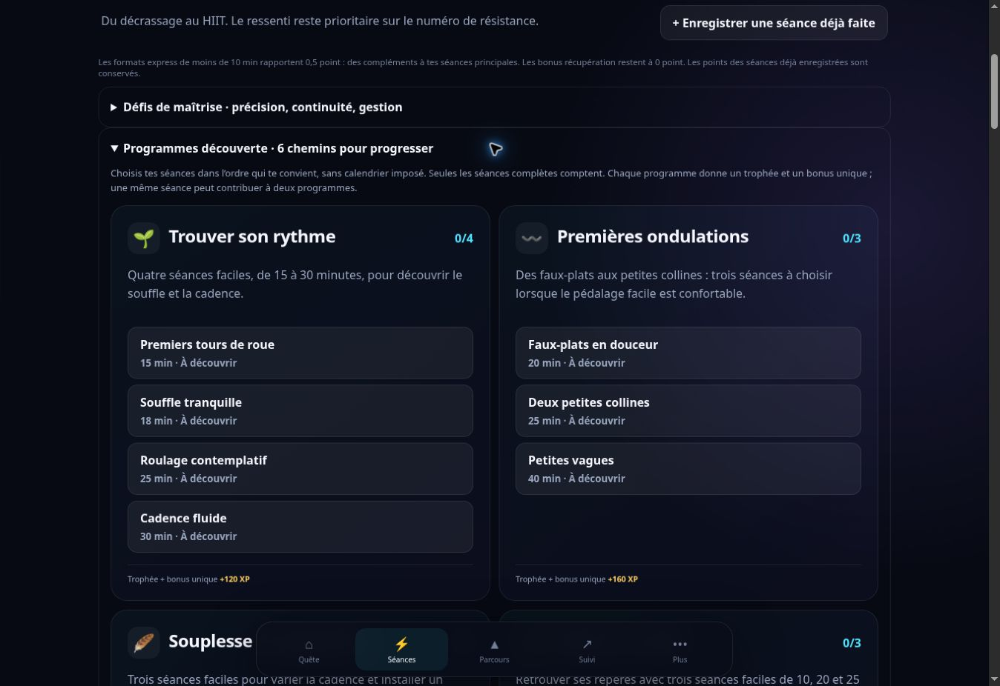

**[Voir les 52 séances et leurs durées →](CATALOGUE.md#seances)**

## 84 raisons de partir ailleurs sans quitter ton vélo

Les façades claires de la Riviera, les berges tranquilles d’un canal, les villages de Provence, les vignes d’Alsace, les lacets d’un grand col : choisis le décor qui donnera une couleur à ta séance. VéloQuest associe des **cartes, des profils de relief, des descriptions et des lieux à découvrir**, pour que la sortie ait une destination autant qu’une durée.

### De la promenade aux sommets

Les **38 balades à 1/5** privilégient un effort doux conseillé, généralement à RPE 2–4, et des pauses libres. Les étapes à **2/5 et 3/5** ajoutent des bosses, des descentes et des récupérations. Les journées sportives retrouvent les difficultés **4/5 et 5/5**, du Ventoux au Galibier, de l’Alpe d’Huez à la Madeleine.

La difficulté et la durée sont deux informations distinctes : une balade facile peut être longue. Les petits formats et le mode Voyage permettent de choisir une sortie adaptée au temps dont tu disposes.

### Douze thèmes pour suivre ton envie d’évasion

| Thème | L’esprit du voyage |
| --- | --- |
| Côte d’Azur | Ports, villes et corniches, de Saint-Raphaël à Menton |
| Estérel et Corniche d’Or | Roches rouges, Méditerranée et forêt ; quatre grandes étapes et deux petits formats |
| Route Napoléon | Quatorze grandes étapes de Golfe-Juan à Grenoble, complétées par quatre courtes escales |
| Vignoble d’Alsace | Six étapes de Marlenheim à Thann et trois parenthèses entre villes et vignes |
| Canal de Nantes à Brest | Un premier pack de quatre parcours autour de Pontivy, Josselin et Peillac |
| Lacs et gorges du Verdon | Sainte-Croix, Castellane et les panoramas des Crêtes |
| Villages de Provence | Vaucluse, Alpilles et Calavon |
| Autour des lacs | Der, Annecy et paysages du Verdon |
| Mers et estuaires | Méditerranée, Atlantique, Manche et baie de Somme |
| Châteaux et patrimoine | Chambord, Loire, remparts et villages |
| Canaux et voies vertes | Midi, Alsace, marais et Camargue |
| Cols et haute montagne | Monuments alpins et pyrénéens, Turini et Bonette |

*Certains parcours appartiennent à plusieurs thèmes. Le pack du canal représente les étapes proposées, pas la totalité de Nantes à Brest.*

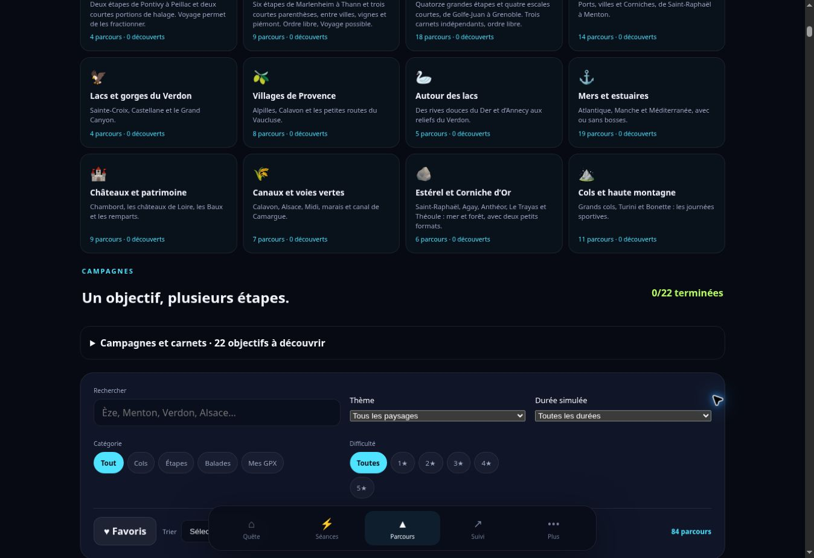

### Le bon parcours, sans chercher longtemps

Recherche un nom de parcours, une ville ou un repère, avec ou sans accents. Combine thème, difficulté, catégorie et durée simulée. Trie par distance, dénivelé, difficulté ou meilleurs chronos. Garde tes idées dans les **favoris** et retrouve tes traces personnelles avec **Mes GPX**.

Avant le départ, chaque fiche te présente distance, dénivelé, profil altimétrique, difficulté, paysage et lieux traversés. Les sources géographiques sont accessibles. Dans le lecteur, les repères donnent un visage à la progression : le lieu atteint, le prochain et la distance virtuelle qui vous sépare.

### Des paysages à regarder aussi

Sur les parcours illustrés, **Voir les photos** ouvre une galerie de vues réelles, avec légendes, dates, auteurs et crédits. Dix photos accompagnent actuellement dix-sept parcours : littoral azuréen, Estérel, Ventoux, Galibier et Alsace. Elles se chargent à l’ouverture et peuvent être préparées pour le hors connexion.

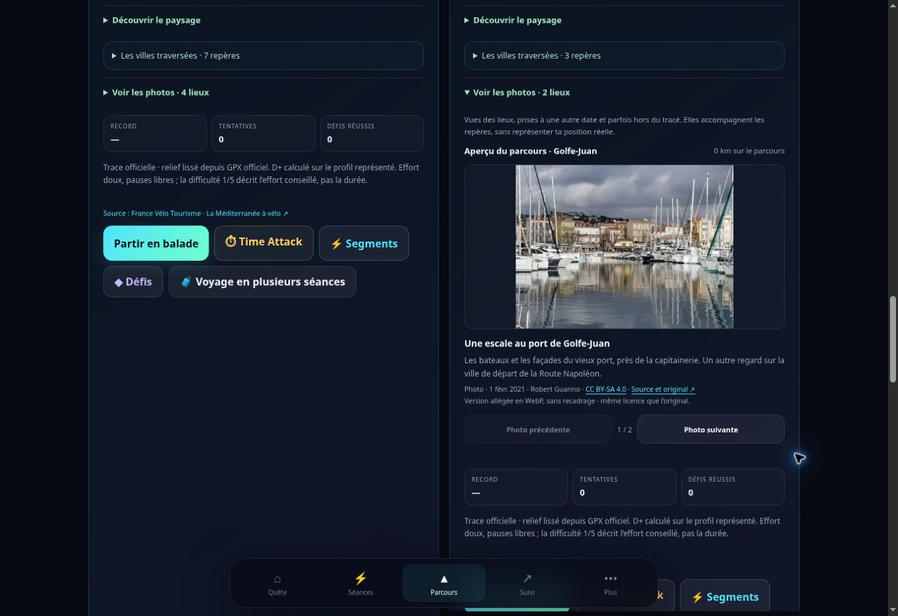

*Les photos montrent les lieux à une autre date et parfois depuis un point de vue extérieur au tracé. L’expérience associe carte, relief, textes et photographies ; elle ne propose pas une vidéo immersive continue.*

### Tes propres routes entrent dans l’aventure

Importe un **GPX** : VéloQuest calcule sa distance, son dénivelé, son profil altimétrique, ses pentes lissées et ses niveaux de résistance conseillés. Le parcours rejoint ton catalogue local et tes sauvegardes. Une route qui compte pour toi peut ainsi devenir une séance ou une étape de carnet.

Les profils servent l’entraînement intérieur. Les quatorze parcours historiques utilisent des profils simplifiés ; les autres traces suivent les méthodes documentées de leurs sources. Ni les cartes ni les niveaux de résistance ne constituent un guidage extérieur ou une reproduction physique exacte du terrain.

**[Découvrir la liste des 84 parcours →](CATALOGUE.md#parcours)**

## Un grand voyage peut commencer par quinze minutes

Tu aimerais parcourir une longue étape, mais tu disposes seulement d’une demi-heure ? **Voyage** conserve le fil de l’aventure. Choisis un parcours natif ou ton propre GPX, puis une portion de **15, 30, 45 ou 60 minutes**. Aujourd’hui, tu avances ; une prochaine fois, tu continues.

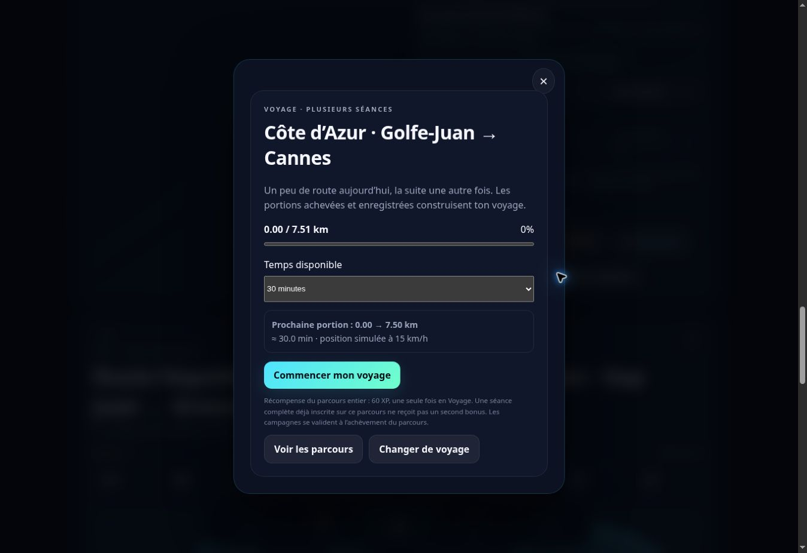

La carte, les lieux et le profil gardent les kilomètres de l’itinéraire entier. Les portions terminées et enregistrées construisent ta progression ; tu retrouves le voyage depuis Quête. Lorsque tout le parcours est couvert, il peut rejoindre tes campagnes et tes trophées, avec sa récompense de parcours attribuée une seule fois en Voyage.

Le principe est simple : **fractionner ton temps, préserver ta destination**. Une portion de Voyage fait avancer le grand parcours ; un format court autonome du catalogue garde, lui, sa propre arrivée et sa propre validation.

Dans cette version, la position du Voyage est **simulée à 15 km/h**, indépendamment des données reçues du vélo. Les kilomètres du compteur restent enregistrés séparément. Les pauses sont libres et les chevauchements ne multiplient pas la progression.

**[Comprendre le mode Voyage →](VOYAGE.md)**

## Des étapes qui deviennent une histoire

### 22 campagnes et carnets prêts à découvrir

Un objectif sur plusieurs sorties donne une autre saveur au prochain départ. Termine les quatre monuments des **Légendes du Tour**, ouvre ton **Passeport azuréen**, complète **Au fil de l’eau** ou compose une traversée de la France à travers les carnets de découverte.

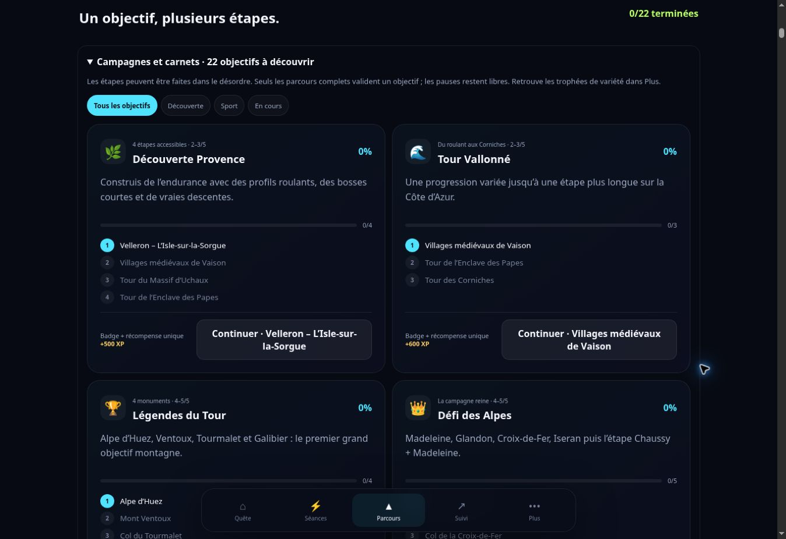

Les cases reflètent les parcours effectivement terminés, même dans le désordre. **Continuer** propose une étape encore manquante. Une même sortie peut contribuer à plusieurs campagnes ; leurs bonus restent uniques. Les secteurs isolés et les tentatives incomplètes ne deviennent pas des parcours entiers.

Les grands projets côtoient les escapades : **Route Napoléon · de la mer à Gap** et ses 900 XP, **de Gap à Grenoble** et ses 700 XP, **Vignoble d’Alsace · la traversée** et ses 650 XP, mais aussi **Parenthèses de l’Estérel**, **Escales du Sud** et **Un paysage en 30 minutes**.

**[Les 22 campagnes, leurs étapes et leurs récompenses →](CATALOGUE.md#campagnes)**

### Tes carnets, dans ton ordre

Dans **Mes carnets de voyage**, tu peux composer jusqu’à **20 carnets de 20 étapes uniques**, en mélangeant parcours du catalogue et GPX personnels. Tu choisis leur ordre avant l’enregistrement, puis tu retrouves la prochaine étape à ouvrir en Voyage.

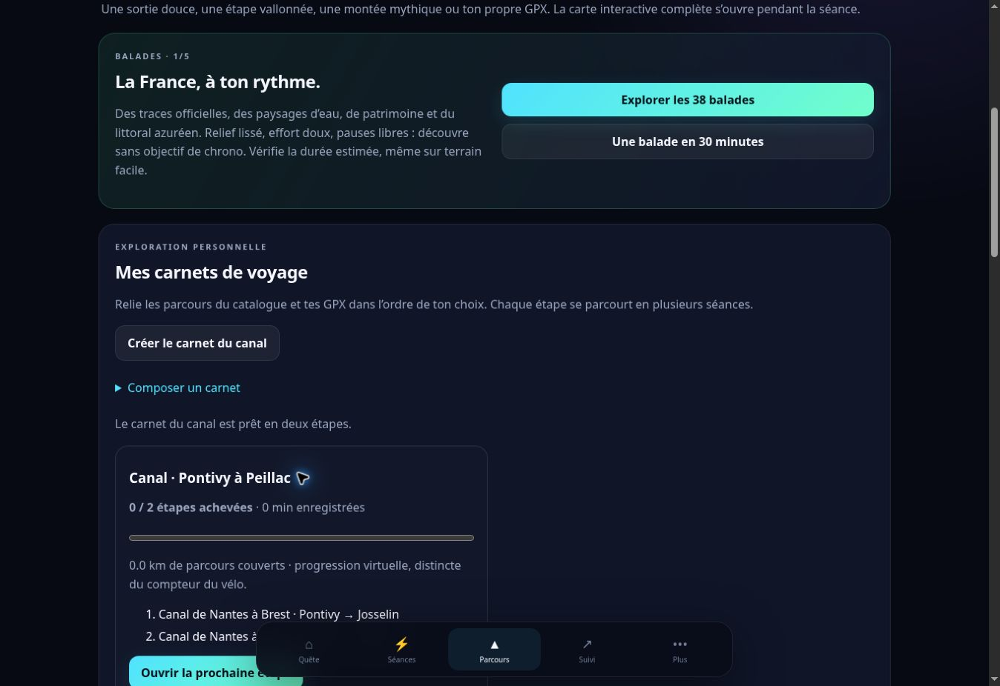

Le carnet du canal se crée directement en deux étapes. Tes propres carnets peuvent réunir tes destinations préférées, une série de petites balades ou un projet au long cours. Leur progression indique étapes achevées, temps enregistré et kilomètres virtuels couverts. Supprimer un carnet conserve les séances déjà enregistrées.

Le passage à l’étape suivante reste une action volontaire : la fin d’une séance ne lance pas automatiquement le parcours suivant.

## Pendant l’effort, les bonnes informations au bon endroit

### Prépare ta sortie avant de lancer le chrono

La préparation présente durée, intensité, segments, résistance conseillée et rythme de pédalage. Sur un parcours, tu retrouves aussi paysage, profil, lieux et éventuelles photos. Tu choisis ta vue et tes réglages avant de démarrer.

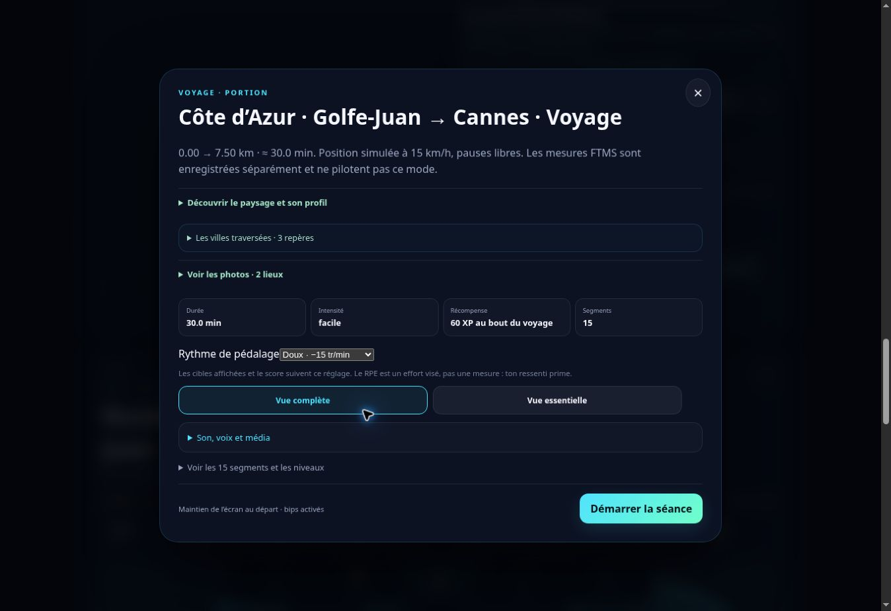

### Deux vues pour deux façons de rouler

La **vue complète** associe carte interactive, profil altimétrique, lieux et profil d’effort. La **vue essentielle** met au premier plan la résistance cible, le temps restant, la prochaine consigne et les commandes. Tu peux changer de vue pendant la séance sans remettre le chrono à zéro.

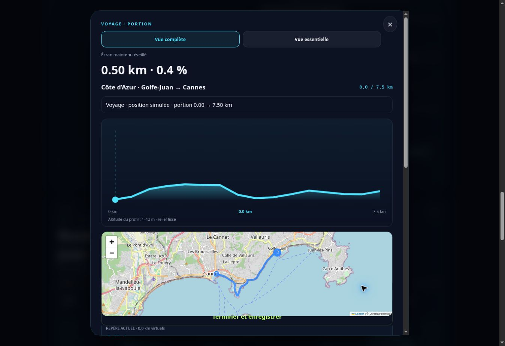

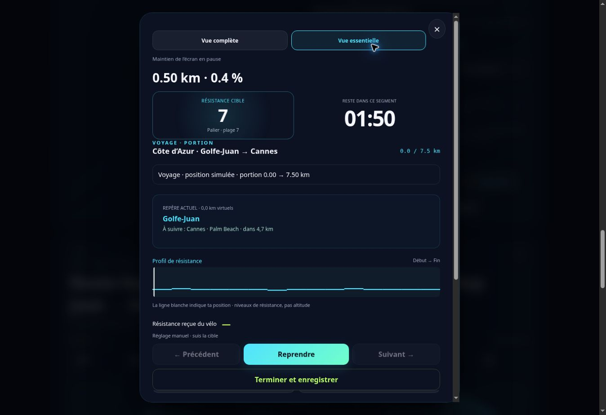

Le lecteur affiche le segment courant, sa cible de cadence lorsqu’elle existe et le RPE visé. Le **profil de résistance** montre l’effort à venir ; il se distingue du profil d’altitude. Les boutons **Alléger −1** et **Renforcer +1** permettent d’adapter la consigne dans les limites du mode choisi. La calibration globale ajuste les niveaux à ton vélo et à tes sensations.

### Des alertes à ta mesure

Configure les bips, la voix du coach, le volume et la fréquence des annonces. Un préavis facultatif peut annoncer un changement minuté dix secondes avant. Teste les alertes avant le départ ; active les vibrations ou le maintien de l’écran quand l’appareil le permet. Le lecteur indique si ce maintien est réellement accordé, interrompu ou indisponible.

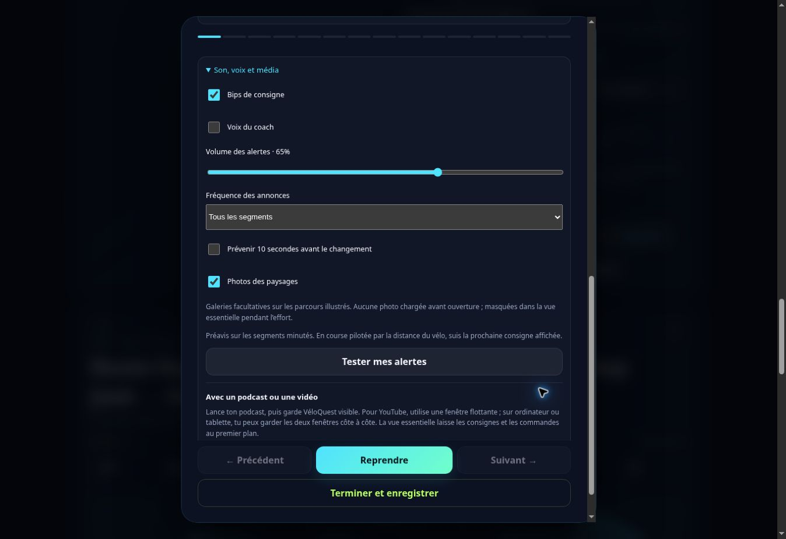

### Garde les mains sur le guidon

Les **commandes vocales facultatives**, sur navigateur compatible, reconnaissent quatre intentions : « Vélo allège », « Vélo renforce », « Vélo pause » et « Vélo reprends ». Les boutons restent disponibles et les règles du mode en cours continuent de s’appliquer : une épreuve à chrono continu ne se met pas en pause par la voix.

L’activation du microphone est volontaire. Selon le navigateur, la reconnaissance peut utiliser un service en ligne ; VéloQuest ne conserve ni audio ni transcription. Sa disponibilité dépend du navigateur, notamment sur iPhone.

### Un podcast, une vidéo, une interruption : la séance reste praticable

Lance ton podcast séparément puis garde VéloQuest visible. Pour une vidéo, utilise une fenêtre flottante lorsque ton appareil et le service le permettent, ou deux fenêtres côte à côte. Il n’est pas nécessaire de choisir entre tes consignes et ton contenu préféré.

Si la page est rechargée ou la séance interrompue, la **reprise locale** permet de retrouver une séance sauvegardée, y compris les modes de parcours pris en charge. L’écran verrouillé ou l’application masquée peuvent toutefois interrompre les alertes et le Bluetooth : le lecteur doit rester visible pour une utilisation suivie.

**[Le guide de confort du lecteur →](READER-COMFORT.md)**

## Le plaisir de jouer avec ta propre progression

### La cadence devient un jeu de précision

Avec une cadence mesurée, VéloQuest peut suivre le temps passé dans la cible et calculer un **score proportionnel à la cadence**, une note de régularité indépendante, la couverture de mesure et des **combos**. Les séries de secondes régulières font monter le multiplicateur jusqu’à ×4. Tu travailles la maîtrise du geste autant que la motivation.

Les records de points comparent les séances à réglages équivalents. Si les données sont insuffisantes, le score reste provisoire. Modifier cadence ou résistance ne permet pas de mélanger artificiellement des performances obtenues avec des consignes différentes.

Dans **Mes repères de cadence**, tu peux personnaliser le décalage de −25 à +10 tr/min. Après trois séances faciles complètes, mesurées et ressenties à 4/10 au maximum, l’application peut proposer un repère personnel, que tu restes libre d’appliquer.

### Trois défis de maîtrise

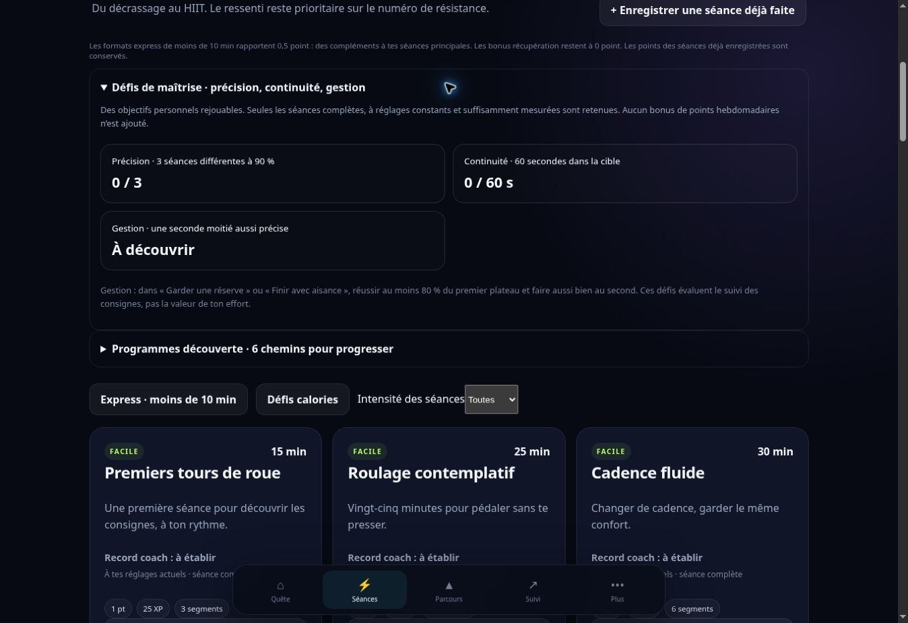

| Défi | Ton objectif |
| --- | --- |
| Précision | Réaliser trois séances différentes à au moins 90 % de suivi |
| Continuité | Tenir un combo d’au moins 60 secondes dans la cible |
| Gestion | Finir aussi précisément qu’au début sur les plateaux des exercices de gestion, après un premier plateau à au moins 80 % |

Ces défis demandent des séances complètes, suffisamment mesurées et à réglages constants. Ils évaluent le suivi des consignes, sans ajouter de points hebdomadaires ni d’XP supplémentaires.

### Time Attack : retrouve ton meilleur toi

Chronomètre un parcours entier, conserve tes tentatives et ton **record personnel**, puis compare ton passage au **fantôme** d’une tentative antérieure. Les temps intermédiaires à 25 %, 50 %, 75 % et à l’arrivée t’aident à comprendre où tu as gagné du temps.

### Segment Attack : une bataille à la fois

Tu préfères te concentrer sur une portion ? Chaque parcours est découpé en **quatre secteurs**, avec des tentatives et des records propres à chacun. Un objectif plus ciblé, sans devoir refaire toute l’étape pour travailler sa dernière partie.

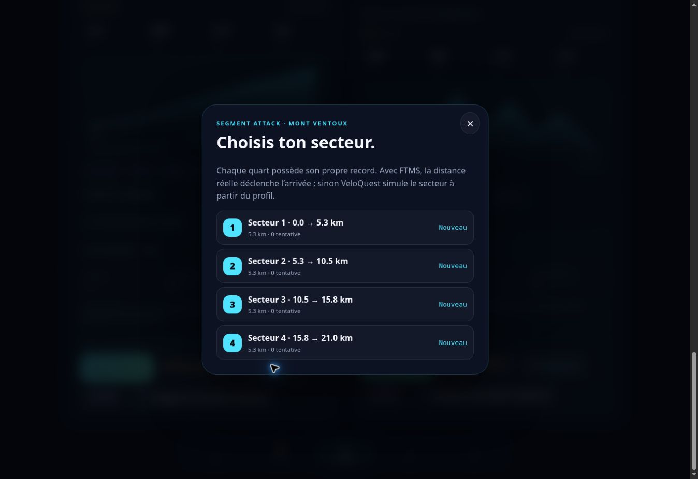

En mode classique, la distance FTMS reçue du vélo peut piloter la progression ; sans elle, la progression est simulée. Un chrono simulé reste un repère de jeu, pas la preuve d’une performance extérieure. Les épreuves chronométrées utilisent un chrono continu.

### Huit défis pour changer ta façon d’aborder un parcours

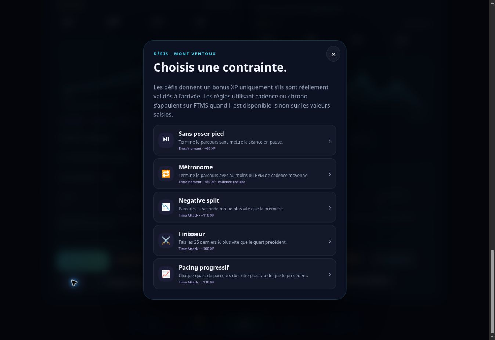

| Défi | Une autre manière de réussir |
| --- | --- |
| Sans poser pied | Terminer sans mettre la séance en pause |
| Métronome | Atteindre la cadence moyenne demandée |
| Negative split | Faire la seconde moitié plus vite que la première |
| Finisseur | Réussir le dernier quart plus vite que le précédent |
| Chasseur de PB | Améliorer ton record personnel |
| Pacing progressif | Accélérer d’un quart à l’autre |
| Briseur de record | Améliorer ton record d’au moins 2 % |
| Grand fond | Terminer une étape admissible à ce défi |

Les défis sont proposés selon le parcours et les prérequis disponibles : certains demandent un record antérieur ou une étape adaptée. Leur bonus est accordé lorsque les conditions sont validées à l’arrivée.

### Défis calories : deux formats, des records séparés

Les épreuves de **5 ou 10 minutes** laissent cadence et résistance libres. Tu suis les calories attribuées à l’épreuve et retrouves tes meilleurs résultats comparables. Les records issus du compteur et ceux saisis manuellement sont séparés ; une tentative interrompue ne devient pas un record complet.

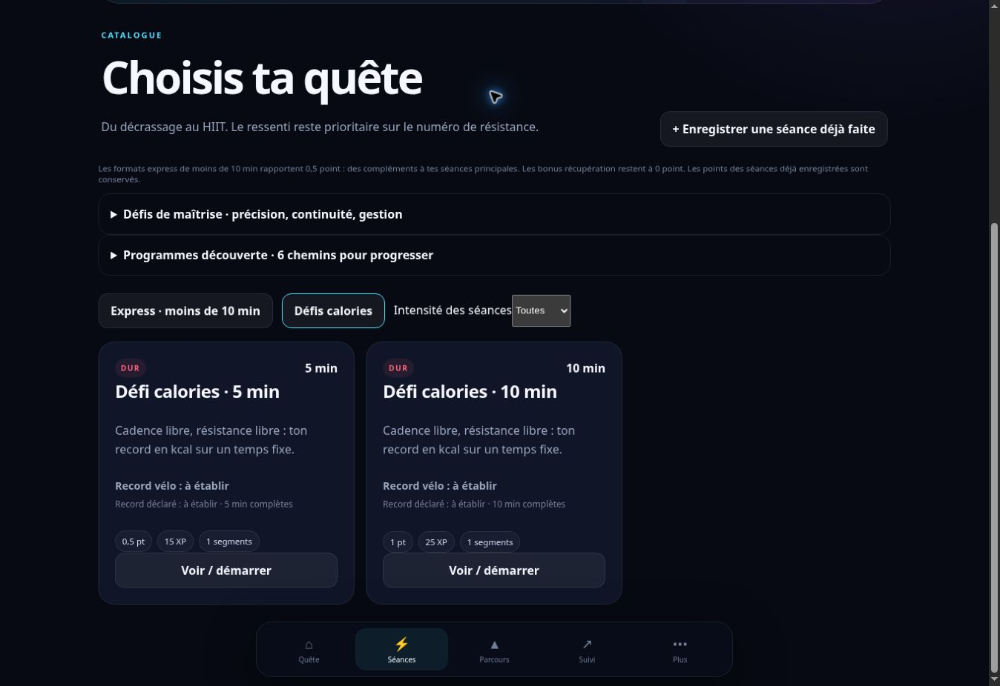

Ces formats sont classés difficiles et restent facultatifs. Les calories du vélo sont une estimation de son compteur, sans conversion en perte de poids garantie.

## Chaque sortie laisse une trace dans ton aventure

Tu accumules de l’**XP**, franchis des niveaux et vois ton titre évoluer. Une semaine parfaite peut ajouter **250 XP** ; les micro-séances faciles ont leur bonus plafonné à **60 XP par semaine**. Les campagnes et programmes offrent leurs propres récompenses uniques.

Les **77 badges** donnent plusieurs raisons de revenir : première séance, régularité, variété, nouveaux paysages, programmes terminés, kilomètres cumulés, objectifs personnels, découvertes régionales ou grands voyages. À chacun sa collection : les **Premiers aigles** de la Route Napoléon, les **Roches rouges** de l’Estérel, les **Vignes et villages** d’Alsace ou le **Grand voyageur**.

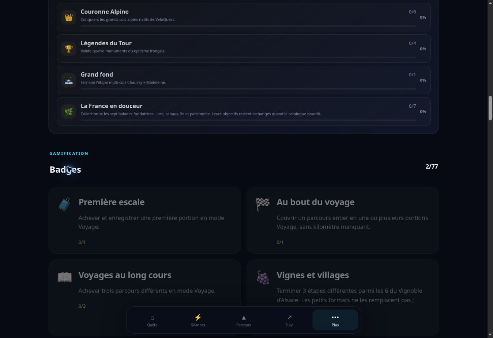

Le **palmarès** rassemble parcours distincts, dénivelé virtuel, défis réussis, Time Attacks et améliorations de records. Quatre collections prolongent le plaisir : **Couronne Alpine**, **Légendes du Tour**, **Grand fond** et **La France en douceur**.

La progression suit ton historique. Une répétition reste une nouvelle séance, mais ne se transforme pas en nouvelle destination. Si tu supprimes une saisie erronée, les objectifs et récompenses concernés se recalculent depuis les séances restantes.

**[Parcourir les 77 badges →](CATALOGUE.md#badges)**

## Des progrès visibles, au-delà du chiffre du jour

### Retrouve le fil de tes séances

Le journal conserve durée, date, heure locale, ressenti et notes. Selon les données disponibles, tu retrouves distance, calories, cadence, puissance, fréquence cardiaque et résistance. La source — manuelle, connectée ou mixte — aide à comprendre l’origine des chiffres.

Une séance faite sans l’application peut être ajoutée après coup. Une erreur peut être supprimée. Le détail accueille aussi **Le regard du coach**, qui remet le ressenti en perspective avec la consigne et, lorsqu’elle est comparable, une réalisation antérieure.

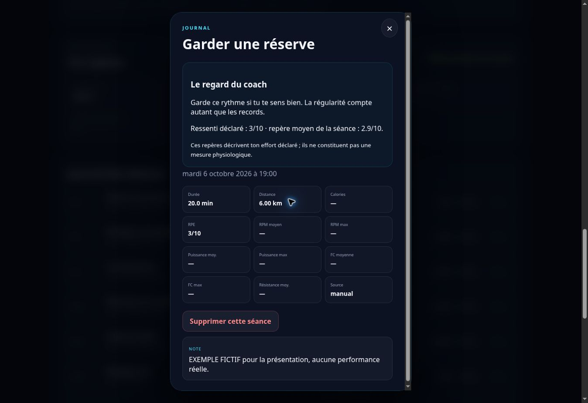

### Un bilan pour prendre du recul

Le bilan hebdomadaire rassemble **temps à vélo, séances réalisées, ressenti moyen et précision de cadence** quand les mesures le permettent. Tu sélectionnes la semaine à consulter pour retrouver tes repères.

Le journal d’habitudes facultatif complète cette vue : marche, renforcement, repas équilibré et récupération. Ces habitudes restent distinctes des minutes et points de vélo. Elles donnent du contexte à ta pratique sans transformer chaque journée en compétition.

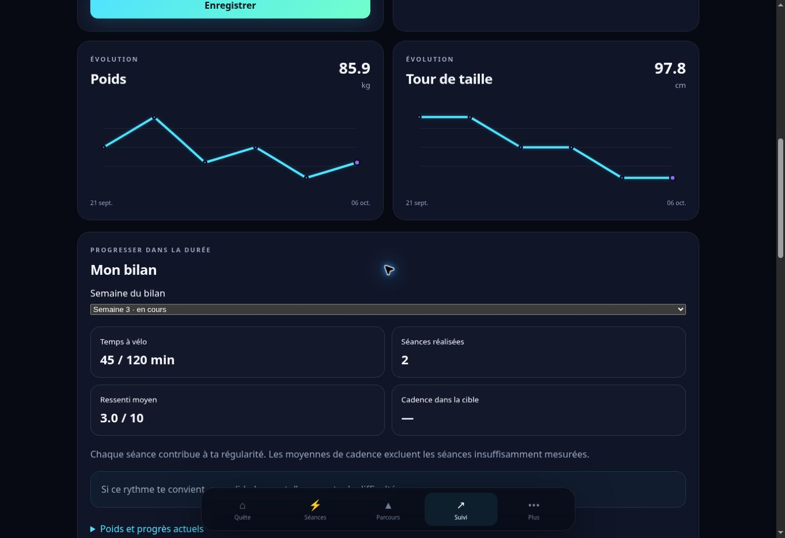

### Ton évolution corporelle, si tu souhaites la suivre

Poids, tour de taille et tour abdominal peuvent être saisis avec leur date. Les courbes de poids et de taille donnent une vue d’ensemble. Le bilan peut comparer les moyennes quotidiennes de poids sur deux fenêtres hebdomadaires lorsque les données sont suffisantes. Les objectifs corporels restent facultatifs : tu peux utiliser toute l’aventure sans en renseigner.

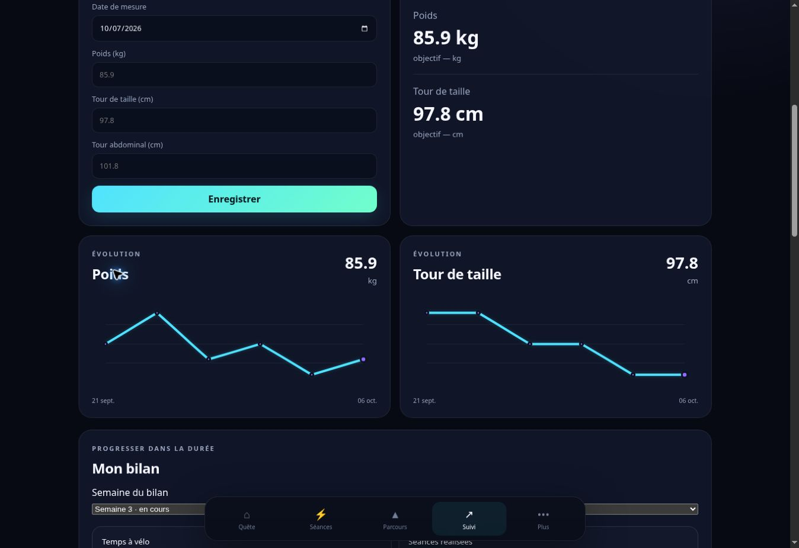

### Des repères de performance qui s’enrichissent avec tes données

Distance cumulée, sortie la plus longue, durée maximale, meilleure puissance moyenne, cadence maximale et estimations de meilleures puissances sur cinq et vingt minutes complètent le suivi. Les traces nécessaires doivent être disponibles ; une métrique absente n’est pas inventée. Les analyses de secteurs permettent également de relire tes parcours chronométrés.

## Ton vélo reste le point de départ

### En manuel : tu peux déjà profiter de l’aventure

Un vélo à résistance réglable suffit pour suivre les consignes, lancer les séances, découvrir les parcours, enregistrer ton ressenti et progresser. Tu ajustes la résistance à la main et renseignes les chiffres utiles affichés par ta console à la fin. L’échelle de référence de VéloQuest va de **1 à 32** ; sur un autre vélo, adapte les niveaux à ton ressenti.

### En connecté : les données viennent enrichir la séance

Sur un navigateur et un vélo compatibles, **Bluetooth FTMS** peut transmettre vitesse, cadence, distance, résistance, puissance, fréquence cardiaque et énergie, ainsi que les autres données effectivement diffusées. La console affiche ces métriques pendant la séance et une trace compacte peut être conservée pour l’analyse.

Le contrôle de résistance est facultatif et dépend des capacités du matériel. L’interface distingue la **cible demandée** de la **résistance reçue**. Le laboratoire FTMS présente les capacités observées ; un diagnostic BLE permet d’examiner les services annoncés et d’exporter un rapport technique limité.

Le fonctionnement du **Toputure TBE5 avec Bluefy sur iPhone** — télémétrie, effet sur la résistance et transfert JSON — a été confirmé par l’utilisateur le 6 octobre 2026. Cette confirmation concerne cette configuration précise. Elle ne vaut pas qualification générale de tous les vélos Bluetooth, navigateurs ou appareils portant un nom proche.

| Tu souhaites… | Ce qu’il te faut |
| --- | --- |
| Suivre les séances, voyager et tenir ton journal | Un navigateur et un vélo utilisable en manuel |
| Recevoir les métriques du vélo | Web Bluetooth et des services compatibles réellement exposés |
| Mesurer ton suivi de cadence | Une cadence transmise pendant la séance |
| Piloter la résistance | Un contrôle compatible et validé sur ta configuration |
| Retrouver une fréquence cardiaque | Une mesure effectivement transmise par le matériel pris en charge |

**[Consulter les informations de compatibilité →](HARDWARE-COMPATIBILITY.md)**

## Une application qui reste simple à vivre

### Sur téléphone, tablette ou ordinateur

La navigation se répartit en cinq espaces : **Quête**, **Séances**, **Parcours**, **Suivi** et **Plus**. Tu retrouves ta séance, ton prochain voyage, tes graphiques ou tes réglages sans changer d’application.

VéloQuest s’installe comme une **PWA**, une application web accessible depuis son icône. Le bouton **Installer VéloQuest** ouvre l’invitation du navigateur lorsqu’elle est disponible, ou les instructions adaptées à ton appareil. Sur iPhone et iPad, le guide explique l’ajout à l’écran d’accueil ; sur Safari Mac, l’ajout au Dock.

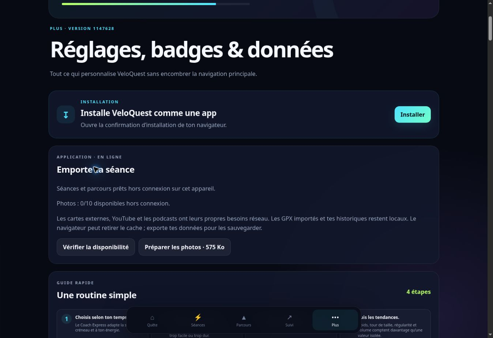

### Emporte ta séance

Dans **Plus → Emporte ta séance**, vérifie que séances et parcours sont disponibles hors connexion sur cet appareil. Les photos peuvent être préparées séparément : le lot actuel représente environ **575 Ko**. Cartes distantes, podcasts et vidéos conservent leurs propres besoins réseau.

Les mises à jour attendent ton action et le repos des lecteurs ouverts. La reprise de séance reste conservée. Le navigateur peut néanmoins retirer son cache : une sauvegarde exportée protège ton historique indépendamment de cette disponibilité locale.

### Tes données à portée de main

Le profil, les historiques, les mesures, les préférences, les favoris, les carnets et les GPX personnels restent stockés dans le navigateur utilisé. Aucun compte ni abonnement n’est requis pour les fonctions locales. Un cloud Firebase facultatif peut être activé sur l’installation : il ajoute un compte e-mail vérifié, la synchronisation entre appareils et des versions récupérables. [Activation du cloud](FIREBASE-SETUP.md).

**Exporter une sauvegarde JSON** permet de garder ton état et tes parcours personnels. Tu peux télécharger le fichier, utiliser le partage lorsque le navigateur le permet ou copier le texte complet puis le coller dans VéloQuest sur l’autre appareil. Des exports **CSV** permettent aussi de reprendre séances et mesures dans un tableur.

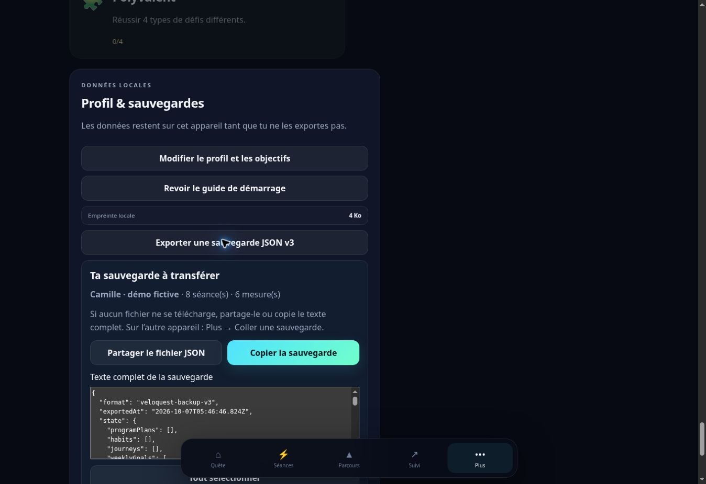

Les anciens formats de sauvegarde restent pris en charge. L’import remplace les données du navigateur de destination ; sauvegarde-les d’abord si tu souhaites les conserver. La séance active interrompue reste propre à l’appareil et n’est pas transférée par le JSON.

Il n’y a pas de synchronisation automatique entre appareils dans cette version. Pour changer de navigateur ou de téléphone, le transfert explicite de sauvegarde est la bonne voie.

**[Guide PWA et hors connexion →](PWA-OFFLINE.md)** · **[Confidentialité →](https://programme-velo.vercel.app/confidentialite)**

## Ta prochaine sortie commence par une envie

| Ce soir, tu te dis… | Essaie ceci |
| --- | --- |
| « Je veux simplement m’y remettre. » | Le guide d’accueil et Premiers tours de roue, 15 minutes faciles |
| « J’ai six minutes, autant en profiter. » | Six minutes de précision, dans les formats express |
| « J’aimerais pédaler en écoutant mon podcast. » | Roulage contemplatif, vue essentielle et alertes testées avant le départ |
| « J’ai envie de voir la mer. » | Golfe-Juan → Cannes ou une parenthèse de l’Estérel |
| « Ce long parcours me tente, mais pas en une fois. » | Voyage, avec une portion de 15 ou 30 minutes |
| « Je veux une idée pour toute la semaine. » | Ma semaine adaptée, puis confirmation des propositions |
| « J’aime avoir un objectif à collectionner. » | Un carnet de découverte ou un des six programmes |
| « Je veux progresser dans ma maîtrise. » | Le métronome et les défis de précision, avec cadence mesurée |
| « J’ai l’énergie pour un défi sportif. » | Un secteur chronométré ou un parcours adapté à ta charge du moment |
| « Je préfère suivre mes propres routes. » | Import GPX, puis composition d’un carnet personnel |

**[Choisir ma première aventure dans VéloQuest →](https://programme-velo.vercel.app/)**

## Les réponses avant ton premier départ

**Faut-il un vélo connecté ?**

Non. Le mode manuel permet déjà de suivre les séances, découvrir les parcours et tenir son journal. Le Bluetooth enrichit les mesures et, sur matériel compatible, le contrôle de résistance.

**Est-ce réservé aux sportifs ou aux amateurs de grands cols ?**

Non. Le guide d’accueil, les séances de reprise et les 38 balades faciles permettent de commencer en douceur. Les cols et les modes compétitifs sont des choix supplémentaires.

**Puis-je faire une longue route avec de courtes séances ?**

Oui, grâce au mode Voyage. Les portions complètes enregistrées font avancer le même parcours. Les carnets personnels permettent ensuite d’organiser plusieurs étapes.

**Est-ce une application de navigation pour sortir à vélo ?**

Non. Les traces, profils et lieux servent une expérience de vélo d’intérieur. Les kilomètres virtuels et les données du compteur sont distingués.

**L’application promet-elle une perte de poids ?**

Elle permet d’accompagner une routine et d’observer ses tendances. Aucun nombre de kilos perdus ni délai de transformation n’est garanti.

**Puis-je retrouver mes données sur un autre appareil ?**

Oui, par export/import JSON, partage ou copie du texte. La synchronisation automatique distante n’est pas activée. Deux navigateurs sur un même téléphone ont également des stockages distincts.

**Le Bluetooth fonctionne-t-il sur tous les iPhone ?**

Cela dépend du navigateur et du matériel. Une configuration Toputure TBE5 + Bluefy a été confirmée par l’utilisateur ; elle ne prouve pas une compatibilité universelle. Le mode manuel reste disponible.

**Peut-on écouter de la musique ou regarder YouTube ?**

Oui, avec le média lancé séparément et les possibilités de ton appareil. Garde VéloQuest visible, utilise si possible une vidéo flottante et teste les alertes avant la séance.

**Tout fonctionne-t-il hors connexion ?**

Le paquet de séances et parcours peut être préparé et vérifié localement, avec les photos en option. Les cartes externes, médias et certaines fonctions du navigateur peuvent nécessiter le réseau.

**Où trouver absolument tout le contenu proposé ?**

Le [catalogue complet](CATALOGUE.md) répertorie les 52 séances, les 84 parcours, les 22 campagnes, les six programmes et les 77 badges de la version présentée.

---

**VéloQuest — Ride · Level up · Repeat.**

Une application conçue par **Térence Ferut / AstroWare Conception** pour donner du relief à la pratique quotidienne.

[Ouvrir l’application](https://programme-velo.vercel.app/) · [Guide utilisateur](USER-GUIDE.md) · [Catalogue complet](CATALOGUE.md) · [Retour au README](../README.md)

*Pour la provenance et l’actualisation des illustrations : [notice des captures](images/presentation/README.md). Les fonctions annoncées correspondent au code et à l’application vérifiés ; les évolutions de la roadmap ne sont pas présentées comme déjà disponibles.*

## Défis au départ lancé

[Six épreuves chrono](TIMED-TRIALS.md) donnent une autre saveur aux séances : aller le plus loin en 1, 5 ou 12 minutes, ou battre son temps sur 1, 5 ou 10 km. Cinq secondes pour prendre son élan, puis le vrai départ ! Résultats de console mesurés ou déclarés restent distincts.
