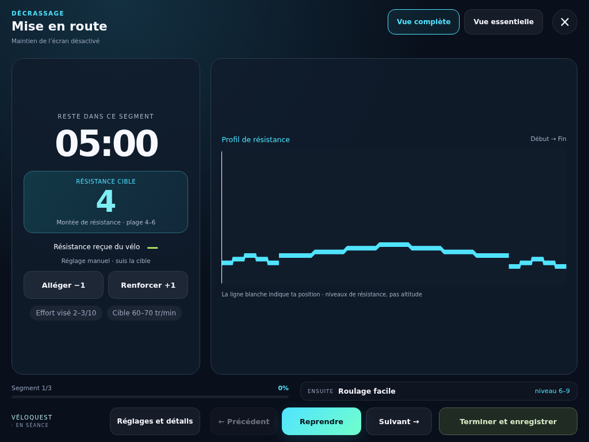
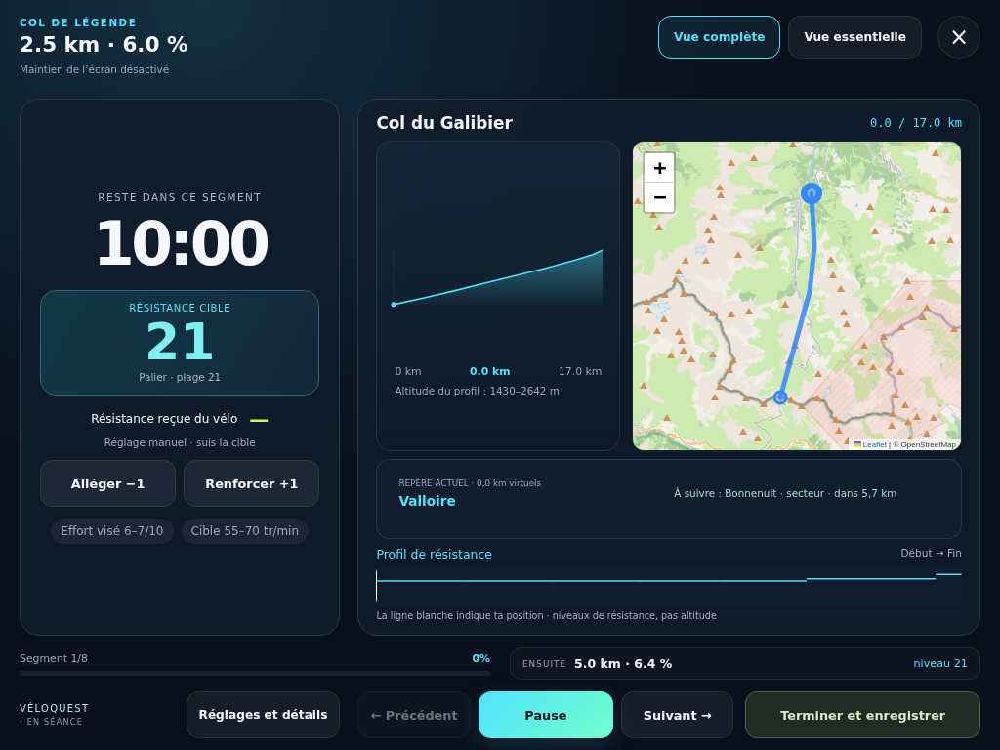

# Lecteur, alertes et média personnel

Actualisé le 7 octobre 2026.

## Choisir une vue

**Plus → Ton cockpit**, la préparation et le lecteur proposent **Vue complète** et **Vue essentielle**. La vue essentielle garde niveau manuel 1–32, temps restant, RPE, cadence cible, prochaine consigne et commandes. Pour un parcours, le lieu atteint et le suivant restent affichés ; pour une course, le chrono et le record restent présents. Carte, profil et détails du paysage reviennent en vue complète. Le changement ne remet pas à zéro une séance, Time Attack ou Segment Attack.

Le choix est une préférence locale exportée dans le JSON v3. Les sauvegardes anciennes conservent la vue complète par défaut. Pause, reprise, mise de côté et enregistrement restent disponibles selon les règles du mode : une course chronométrée ne propose pas de pause.

## Tableau de bord sur tablette en paysage

Pendant la séance, à partir de 960 px de largeur et 560 px de hauteur utiles en paysage, le lecteur occupe toute la fenêtre :

- à gauche : compte à rebours, résistance cible, résistance reçue, réglage de l’effort, RPE et cadence cible ;
- à droite : profil de résistance et, pour un parcours, carte, altitude, position et chronométrage ;
- en bas : mesures disponibles du vélo, progression, prochaine consigne et commandes permanentes.

**Réglages et détails** ouvre un panneau avec les alertes, commandes vocales, photos, lieux et détails du parcours. **Revenir à la séance** ou Échap le referme. La séance continue selon son état actuel pendant la consultation. Les réglages longs et le bilan final peuvent défiler ; le tableau de bord courant vise à tenir sans défilement aux dimensions tablette normales.

La disposition s’adapte automatiquement à la rotation sans relancer le lecteur, modifier le chrono ni perdre les réglages. La vue essentielle conserve ses fonctions et le profil d’effort, tout en retirant la carte, l’altitude et les photos. Si la fenêtre est trop petite (écran partagé, zoom ou téléphone), une présentation verticale défilante garde toutes les commandes accessibles. Il s’agit de toute la fenêtre disponible, sans obligation d’activer le plein écran système.

### Aperçus sur tablette 1024 × 768

Captures Chromium du lot PR 56, profil de test fictif ; séance manuelle et parcours simulé. La carte crédite OpenStreetMap. Ces captures illustrent le lecteur, pas une qualification de tablette ou de vélo physique.

## Régler et vérifier les alertes

Ouvre **Son, voix et média** avant de partir. Active bips et/ou voix, règle leur volume de 0 à 100 %, puis choisis tous les segments ou seulement les changements de résistance, RPE ou cadence. Un nouveau nom de ville à consigne identique peut ainsi rester silencieux. Le retour haptique se règle dans Plus et dépend du navigateur.

**Tester mes alertes** envoie une courte consigne. Vérifie ce que tu entends avec ton casque et ton média : le volume du téléphone, le mode silencieux, les permissions et le traitement audio du système interviennent aussi. « Test envoyé » indique l’émission, sans prétendre mesurer ce qui est audible. Le volume zéro coupe bips et voix ; il ne coupe pas les vibrations activées séparément.

La voix utilise le niveau corrigé par la calibration globale et l’ajustement du coach. Le **préavis dix secondes** est facultatif, désactivé par défaut, et concerne les segments minutés. Il annonce la prochaine consigne une fois avant le changement ; au changement, la consigne actuelle est annoncée. Il ne fournit pas de prédiction temporelle pour une course pilotée par la distance FTMS. En arrière-plan, les annonces sont évitées plutôt que rejouées en rafale au retour.

## Écouter un podcast ou regarder YouTube

1. Lance le podcast ou la musique dans ton application habituelle.
2. Reviens dans VéloQuest et choisis la vue essentielle si tu veux alléger l’écran.
3. Teste les alertes avec le média en lecture et règle leur volume.
4. Pour une vidéo, active le mode image dans l’image lorsque YouTube et ton appareil le proposent. Sur ordinateur/tablette, garde les deux fenêtres côte à côte et VéloQuest visible.

Le mode flottant de YouTube et sa lecture en arrière-plan sont deux fonctions différentes ; leur disponibilité dépend notamment du contenu, de l’appareil et de l’offre YouTube. VéloQuest ne contient pas de lecteur YouTube intégré et ne contourne aucune restriction. Les alertes vocales peuvent réduire, interrompre ou remplacer le son du média selon le système : cette coexistence doit être essayée sur ton appareil.

## Écran éveillé et arrière-plan

Le réglage **Garder l’écran éveillé** demande un maintien uniquement pendant une séance en cours. La préparation ne l’annonce pas déjà accordé. Le lecteur affiche l’état réel : demande, accord, indisponibilité, refus ou interruption. Pause, fin et fermeture relâchent la demande. Un accord tardif après fermeture est relâché lui aussi.

Quand VéloQuest redevient visible, l’application redemande le maintien si la séance tourne et affiche un rappel pour vérifier la consigne et la connexion du vélo. **Réessayer le maintien** est proposé après refus ou interruption. Le système garde la décision finale, notamment selon la batterie et la visibilité.

Verrouiller l’écran ou masquer VéloQuest peut suspendre minuteurs, annonces et Bluetooth. La reprise locale conserve l’état connu ; elle ne prouve pas une mesure continue du vélo pendant l’absence. Garde VéloQuest visible pour une séance guidée fiable. Le mode manuel et la saisie finale restent disponibles.

## Portée des vérifications

Les **Photos des paysages** sont facultatives dans les fiches, la préparation et la vue complète ; elles sont masquées pendant l’effort en vue essentielle. Une galerie fermée ne charge aucune photo. La navigation libre n’avance ni le lecteur ni les kilomètres du Voyage. Les légendes distinguent le lieu illustré du point de vue photographique. [Guide des photos](LANDSCAPE-PHOTOS.md).

Les tests unitaires couvrent préférences, sauvegardes, calibration, filtrage des annonces, volume et contexte audio. Les tests Chromium mobile/ordinateur couvrent changements de vue, pause/reprise, arrivée, course/secteur, conservation des historiques et simulation des accords/refus/libérations du maintien de l’écran. Voix et maintien sont simulés : ils ne prouvent ni l’audibilité, ni le fonctionnement réel du TEB5, ni une installation Safari/iPhone, ni la lecture simultanée d’un média sur un téléphone physique.

À réception du vélo et sur les appareils utilisés : essayer casque/podcast, alerte de changement, volume nul, passage arrière-plan/retour, veille, reprise et reconnexion. Suivre aussi le [protocole matériel](TEB5-BLUETOOTH-VALIDATION.md). Exporter les données avant un transfert d’appareil ; elles restent locales.

## Références de plateforme

- [YouTube : image dans l’image](https://support.google.com/youtube/answer/7552722?hl=fr) — disponibilité et réglages selon appareil/contenu.
- [MDN : Screen Wake Lock API](https://developer.mozilla.org/en-US/docs/Web/API/Screen_Wake_Lock_API) — visibilité, refus et libération par le système.
- [MDN : Page Visibility API](https://developer.mozilla.org/en-US/docs/Web/API/Page_Visibility_API) — limitations des tâches en arrière-plan.

Références consultées le 5 octobre 2026. Les essais physiques restent à réaliser.

## Préparer et enregistrer sa séance

La préparation et le bilan affichent les étapes **Préparer → Pédaler → Enregistrer**. En paysage à partir de 960×560 pixels CSS utiles, ils occupent une fenêtre large : le programme ou le récapitulatif à gauche, les réglages ou les mesures à droite. Les zones longues défilent séparément ; le lancement et la confirmation restent accessibles en bas. Sur téléphone, les informations s’empilent avec un défilement normal.

Avant le départ, le profil de résistance complète la durée, l’intensité et les segments. Le mode manuel est expliqué lorsqu’aucun vélo n’est connecté. Les modes chronométrés rappellent que le chrono continue pendant les interruptions. Les réglages de cadence, de son, de voix et de vue restent disponibles.

Le bilan conserve tous les champs et la case de vérification obligatoire. Une rotation ne réinitialise pas les valeurs saisies. Le récapitulatif ne prétend pas que la séance est enregistrée : il faut confirmer, puis retrouver le résultat dans **Suivi**.

Lorsqu’une mise à jour PWA est prête, une annonce apparaît sur les écrans principaux, en dehors du lecteur et de sa préparation/bilan. **Plus** conserve son panneau détaillé. La mise à jour demande une action explicite ; elle reste protégée pendant une séance, une saisie, une connexion vélo ou lorsqu’un autre onglet est occupé. Il n’est pas nécessaire d’effacer les données pour mettre l’application à jour.

## Repères et nouveautés

Avant le départ, « Les repères du lecteur » explique niveau de résistance, cadence, RPE et mesure indisponible. Cette aide repliée s’ouvre au clavier ou au toucher, sans démarrer la séance ni changer ses réglages. Elle reste accessible dans Plus → Guide rapide. Les consignes, valeurs reçues et distances simulées y sont distinguées.

Plus → Quoi de neuf regroupe les jalons éditoriaux. L’annonce sur Quête est facultative, disparaît après « Voir les nouveautés » ou « Plus tard » et se synchronise entre onglets du même navigateur. Le marqueur local ne contient qu’un identifiant de version ; il ne fait pas partie de l’export sportif. Si son stockage échoue, la consultation fonctionne mais l’annonce pourra revenir au rechargement. Les notes restent consultables dans Plus.

L’annonce ne s’affiche pas pendant une séance, la configuration ou une reprise en attente, ni avant les trois premières séances complètes du démarrage accompagné. Il n’y a pas de pop-up automatique. Le contenu correspond à la version actuellement ouverte, pas à une version distante en attente d’installation.

Maintenance : ajouter un jalon en tête de `lib/releases.ts` avec un nouvel identifiant stable, une date et des changements réellement livrés. Un simple rebuild ne doit pas changer cet identifiant. Garder les précédents jalons pour la consultation dans Plus ; ne pas annoncer les éléments futurs de la roadmap comme disponibles.
